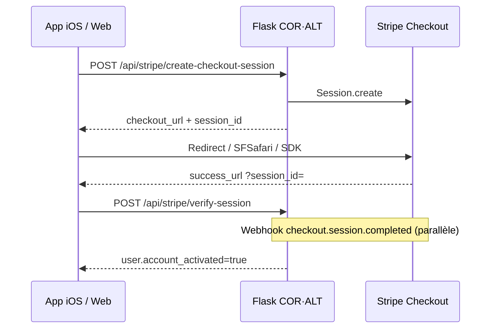

# Feature : Stripe Checkout

Paiement d’activation COR·ALT — forfait unique ou abonnement mensuel.

## Vue d’ensemble

Activation réelle = `users.account_activated = 1` + `plan` + `stripe_checkout_session_id` (`fulfill_checkout_session` dans `coralt_stripe.py`).

## Prérequis

| Prérequis | Détail |
|-----------|--------|
| Auth | Session cookie (utilisateur connecté) — sauf webhook |
| Compte non activé | Sinon `400` « déjà activé » |
| Stripe configuré | Secret key présente (`stripe_enabled()`) sinon `503` |
| Plan | `1`, `2` ou `3` |
| Billing | `once` (défaut) ou `monthly` |

## Catalogue prix

| Plan | Titre | Unique (cents) | Mensuel (cents) |
|------|-------|----------------|-----------------|
| 1 | Essentiel | 6000 | 2000 |
| 2 | Avancé | 8000 | 3500 |
| 3 | Complet | 9000 | 4000 |

Price IDs Stripe optionnels via env `STRIPE_PRICE_PLAN_{n}[_MONTHLY]_{TEST|LIVE}` ; sinon `price_data` inline EUR.

## Modes Checkout

| Billing | Stripe `mode` | URLs |
|---------|---------------|------|
| `once` | `payment` + invoice_creation | success / cancel sur `/recherche` |
| `monthly` | `subscription` + metadata abonnement | idem |

Metadata session : `plan`, `user_id`, `user_email`, `billing`.

`client_reference_id` = `user_id`.

### URLs (base = `CORALT_BASE_URL`)

- Success : `{base}/recherche?checkout=success&session_id={CHECKOUT_SESSION_ID}`
- Cancel : `{base}/recherche?checkout=cancelled`

À la création : `UPDATE users SET plan = ?, stripe_checkout_session_id = ?`.

## Fulfillment

Déclenché par :

1. Webhook `checkout.session.completed`
2. `retrieve_and_fulfill_session` (verify-session côté client)

Conditions : `payment_status == "paid"` + metadata plan/email valides.

Idempotence : si déjà activé avec le même `stripe_checkout_session_id` → OK.

## Reçu / facture

`GET /api/stripe/purchase-receipt` — compte activé + session stockée → URLs Stripe (`receipt_url`, `invoice_url`, `document_url`).

## Flux UI (`PlanPickerStep`)

1. Toggle billing + tabs plan 1–3
2. CTA → `create-checkout-session` → `window.location = checkout_url`
3. Retour `checkout=success` → `verify-session`
4. Fallback « J'ai déjà payé » → `refreshUser` (`/me`)
5. Admin → `request-plan` (pas Stripe)

## Port iOS

| Sujet | Recommandation |
|-------|----------------|
| Ouvrir Checkout | ASWebAuthenticationSession / SFSafariViewController **ou** Stripe PaymentSheet / Checkout SDK |
| Success deep link | Universal Link vers `/recherche?checkout=success&session_id=` **ou** custom scheme `coralt://checkout/success?session_id=` (nécessite alors adapter `success_url` côté serveur pour clients mobiles) |
| Cancel | Deep link cancel → réafficher PlanPicker avec notice |
| Session cookie | Doit survivre au retour Safari (même domaine / cookie jar partagé) — sinon Bearer obligatoire avant verify |
| Webhook | Côté serveur uniquement ; l’app n’appelle pas `/api/stripe/webhook` |
| Sécurité | Ne jamais embarquer `STRIPE_SECRET_KEY` ; verify + webhook côté backend |

Si l’app ne peut pas partager le cookie avec Safari : prévoir endpoint mobile avec Bearer + `session_id`, ou Stripe SDK + confirmation serveur.
