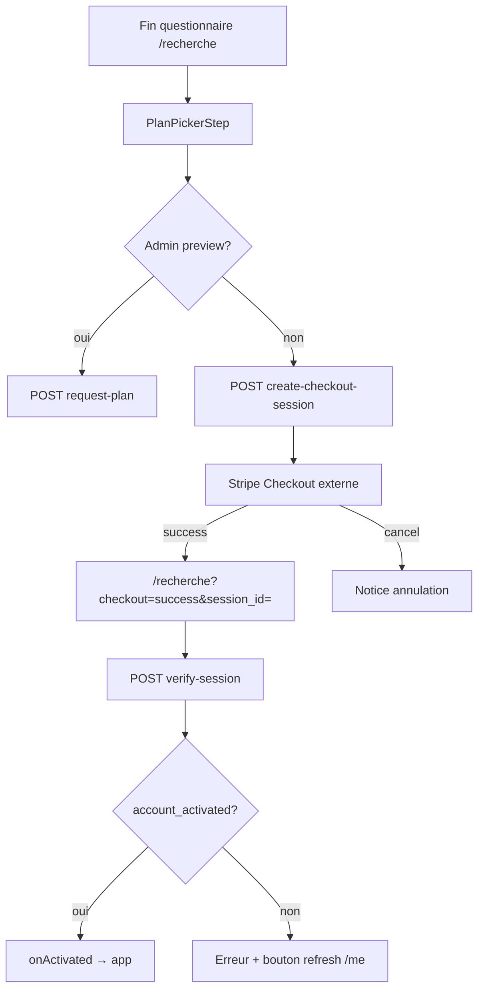

# Page Activation / Plans

Documentation pour le port iOS (JS) — choix de formule et paiement.

## Routes

| Route | Rôle | Gate |
|-------|------|------|
| `/plans` | Aperçu admin du picker de plans | `PlansGate` — admin uniquement ; non-admin activé → `/entreprises` ; non-admin non activé → `/recherche` ; non connecté → `/connexion?return_to=/plans` |
| `/recherche` (fin onboarding) | Vrai parcours utilisateur | `ActivationGate` autorise `/recherche` même si compte non activé |
| Composant UI | `PlanPickerStep` | Utilisé par `ActivationPage` (`adminPreview`) et `SearchOnboardingWizard` (`embedded`) |

Fichiers :

- `frontend/src/pages/ActivationPage.jsx`
- `frontend/src/components/onboarding/PlanPickerStep.jsx`
- `frontend/src/utils/accountActivation.js`
- `frontend/src/utils/planAccess.js`

## Gates

### `ActivationGate` (shell app)

- Tant que `!isAccountActivated(user)` : seules `/recherche` et `/console` (alias) sont accessibles.
- Toute autre route app → redirect `/recherche`.
- Resync profil via `refreshUser()` au mount.

### `PlansGate`

1. Sync `refreshUser()`.
2. Si activé et **pas** admin → redirect hard `/entreprises`.
3. Si pas admin → `/recherche` (pas d’accès à `/plans`).
4. Admin → `ActivationPage` en mode test (`adminPreview`).

### `isAccountActivated(user)`

- `user.is_admin` → toujours considéré activé.
- Sinon `coerceBool(user.account_activated)`.

## États UI (`PlanPickerStep`)

| État | Description |
|------|-------------|
| `activePlanId` | 1 / 2 / 3 (défaut depuis `user.plan` ou 2) |
| `billing` | `once` \| `monthly` (query `?billing=monthly`) |
| `busy` | Redirect Stripe / vérification en cours |
| `refreshBusy` | Bouton « J'ai déjà payé » |
| `error` / `checkoutNotice` | Erreurs paiement / annulation |

### Plans catalogue (client)

| id | Titre | Unique | Mensuel |
|----|-------|--------|---------|
| 1 | Essentiel | 60 € | 20 €/mois |
| 2 | Avancé | 80 € | 35 €/mois |
| 3 | Complet | 90 € | 40 €/mois |

Aligné backend `PLAN_CATALOG` dans `coralt_stripe.py` (centimes).

## Appels API

| Contexte | API | Body | Effet |
|----------|-----|------|-------|
| Utilisateur normal — payer | `POST /api/stripe/create-checkout-session` | `{ plan, billing }` | Redirect `checkout_url` |
| Retour Stripe success | `POST /api/stripe/verify-session` | `{ session_id }` | Active compte si `paid` |
| Bouton « déjà payé » | `POST /api/auth/me` (via `refreshUser`) | `{}` | Relit `account_activated` |
| Admin preview | `POST /api/auth/request-plan` | `{ plan }` | E-mail test `[TEST]`, **ne change pas** le plan admin |

### Query URL Stripe

- Success : `/recherche?checkout=success&session_id={CHECKOUT_SESSION_ID}`
- Cancel : `/recherche?checkout=cancelled`
- Billing préservé : `?billing=monthly`

## localStorage / SecureStore

Pas de clé dédiée activation. Le flag `account_activated` vit dans :

- cookie session + DB `users.account_activated` ;
- cache `coralt_session_v2` (invalidé / forcé false au boot jusqu’à `/me`).

## Flux utilisateur

### Mode admin (`ActivationPage`)

- Bannière : e-mail part avec préfixe `[TEST]`, plan admin non modifié.
- CTA : « Envoyer un e-mail de test » → `request-plan`.

## Accès par plan (post-activation)

| Feature | Plan min | Helper |
|---------|----------|--------|
| Recherche / liste / adresse | 1 | — |
| Contacts + infos entreprise | 2 | — |
| Mailing / CV Gmail / swipe Envois | 3 | `hasMailingAccess`, `hasEnvoisAccess` |
| Gates routes `/mailing`, `/envois` | 3 | `Plan3Gate`, `EnvoisGate` → sinon `/recherche` |

## Port iOS

- Écran « Formules » en fin d’onboarding (équivalent embedded `PlanPickerStep`).
- **Deep link Stripe** : ouvrir Checkout (SFSafariViewController / ASWebAuthenticationSession ou Stripe SDK) ; success URL custom scheme / Universal Link → `session_id` → `verify-session`.
- Préserver `billing` dans le deep link retour.
- Admin preview optionnel (si app admin) ; sinon uniquement checkout.
- Après `fulfilled` / `account_activated` : naviguer vers l’app principale (équivalent `/entreprises`).
- Bouton « J'ai déjà payé » = refresh profil (webhook peut être en retard sur verify).
